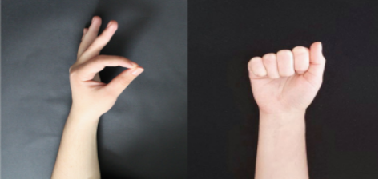
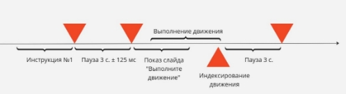
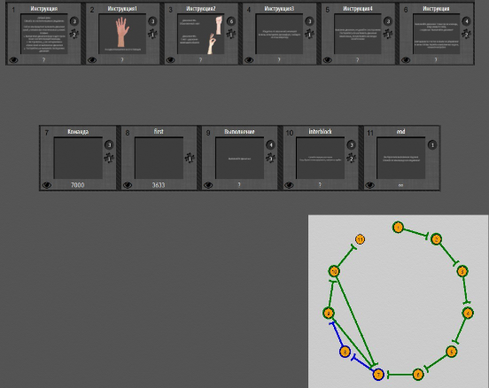
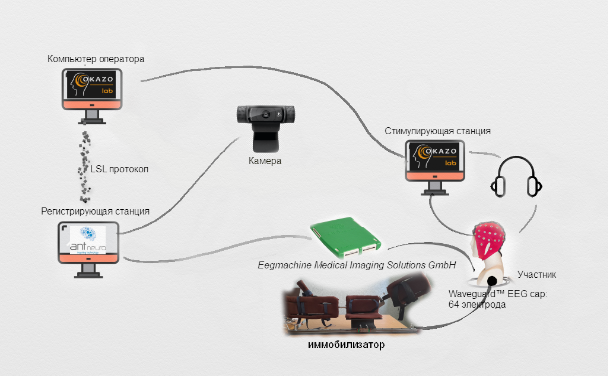

## Описание

TensorFlow Lite-модель для классификации данных ЭЭГ,
предназначена для запуска на микроконтроллере.

В репозитории содержится модель в форматах keras и tflite, программа для контроллера
на базе Arduino и тесты-примеры в Jupyter Notebook.

Программа для Arduino содержит веб-сервер с запущенной на нем моделью
для удобства тестирования модели в реальном времени.

### Дизайн исследования

**Участники.** Исследование проводилось на 4 участниках. Каждый участник совершил один визит в лабораторию с
ориентировочной длительностью 2,5 часа.  

Участники соответствовали следующим требованиям: 

- возраст от 22 до 27 лет;
- отсутствие моторных и психических заболеваний;
- нормальный или скорректированный до нормального слух;
- правши.

К исследованию допускались только здоровые участники. 

**Процедура.** Регистрация данных производилась в один сеанс. Участники были проинструктированы сидеть напротив экрана
компьютера. Перед регистрацией было дано полное объяснение экспериментальной парадигмы.

В рамках данной работы выбрано два движения: обыкновенный схват и схват-удержание маленького объекта. Конечные позиции 
этих движений показаны на рис 1.



Рис.1 Конечные позиции движений, исполняемых участниками.

**Структура визита:**

- Приход участника
- Заполнение форм опросников, анкетирование
- Ознакомление с исследованием
- Наложение электродов ЭЭГ
- Запись в состоянии покоя (rest)
- Перерыв для участника, проведение неполной иммобилизации правой руки (движение кисти и пальцев свободное)
- Регистрация в условиях отсутствия ограничения движения
- Перерыв для участника. Полная иммобилизация конечности
- Регистрация с полной иммобилизацией 
- Конец визита

#### Экспериментальные блоки

Запись в покое, блок свободного выполнения движений, блок с ограничением за счет иммобилизатора.

Движение выполняется только правой рукой, она же является ведущей для каждого из участников. Движения сравниваются при 
двух условиях (два основных блока, соответственно): движение без ограничений, полная иммобилизация. В каждом условии 
движение выполняется 30 раз. Перед выполнением основной части эксперимента регистрируется состояние физиологического 
покоя, после чего участник проходит тренировку, состоящую из 6 повторений. Эксперимент поделен на микроблоки по 10 
циклов, между которыми дается неограниченное время на отдых участника.

Каждое действие участника выполнялось строго после соответствующей команды.  Усредненная структура цикла представлена 
на рис. 2. Команды реализовывались через голосовой гид. Индексирование окончания воображаемого движения осуществлялось 
оператором, после чего запускался следующий цикл. 



Рис.2 Структура цикла. Красными треугольниками обозначены места, в которых были расставлены метки.

Было важно разделить различные компоненты движения так, чтобы избежать их чрезмерного пересечения. Это требование 
обусловливают тайминги сценария. Каждое движение является произвольным и самостоятельно инициированным, имеющим план 
за счет использования голосового гида и отсутствия команды “старт!”, что также вызвано нашим желанием избежать 
появления CNV (contingent negative variability), характерной для задач с сигналом к действию и пересекающейся с нашей 
целевой метрикой. Участникам была дана рекомендация не выполнять действие сразу же после голосовой команды. Был заложен 
временной диапазон, в котором участники могли выполнять движение без необходимости торопиться. Индексирование 
окончания движения вручную проводил оператор. 

Важным аспектом моторного воображения является его связанность с исполняющим лицом, что было крайне важно учесть 
в дизайне исследования.  Одной из важных причин использования голосового гида вместо визуальных стимулов, стала 
необходимость делать визуальные образы не только конгруэнтными, чего сложно добиться, но и такими, чтобы человек 
представлял движение, исполняемым от собственного лица перед его реальным выполнением.

#### Сценарий предъявления



Рис.3 Сценарий предъявления, разработанный в EventIDE

Условия перехода по слайдам изображены в нижней правой части изображения. 

События №1-6: инструкция к выполнению задачи изображены как слайды на рисунке.

**Инструкции участника.** 

- Добрый день!
  Спасибо за участие в нашем исследовании, посвященном исследованию воспроизведения моторных образов.
  Сейчас вашей задачей является изучение действий, которые вам нужно будет выполнять по команде.
  Не беспокойтесь, если вы не запомнили, что нужно делать с первого раза. Это тренировка
- Выполняйте все задачи только правой рукой. 
- Сконцентрируйтесь на движении
- При представлении движения постарайтесь не выполнять никаких явных/видимых движений. 

Событие №7: команда от аудиогида. 

Запас времени перед предъявлением звукового сигнала дается с целью избежания подготовленности участника к выполнению 
действия и соответственно, выработки автоматического действия. 

Для избежания автоматизма в выполнении движений, в сценарии предусмотрено выполнение двух движений, появление команд 
для которых рандомизовано. Участникам также нужно было выполнять движение строго после появления надписи
“Выполните движение” на экране, а не сразу после прослушивания команды от аудиогида, что позволяло создать условия
для планирования движения. 

Предъявляли два варианта команды:

1) Выполните обыкновенный схват

2) Выполните схват и удержание маленького объекта

#### Инструментарий

Экспериментальный сценарий был разработан с использованием EventIDE - программы, позволяющей работать с различными 
типами стимулов, в том числе аудио-контентом. 

Запись ЭЭГ проводили с помощью 64-канального шлема waveguard, электроды располагались соответственно международной
системе 10-10, регистрация выполнялась монополярно заземляющий электрод в позиции AFz, референт в позиции CPz.
Для регистрации  сигнала использовали систему eego mylab (ANT Neuro) с частотой дискретизации 2048 Гц. 

Для ограничения движения мы разработали иммобилизатор. Рука в нем прочно фиксировалась ремнями от пальцев до области
плечевого сустава. В иммобилизаторе предусмотрели возможность подстройки под индивидуальные параметры участника
(подстройка длин и углов), что позволило прочно закрепить конечность, без серьезного неудобства для человека.
В целях достижения удобства участника иммобилизатор, закрепленный на столе, способен перемещаться ближе и дальше от
тела, благодаря специальной рельсе. 



Рис. 4. Экспериментальная установка

Весь процесс регистрировался на камеру для последующего анализа записи

Обработка данных проходила в EEGLAB и ERPLAB- программные пакеты MATLAB. Разметка видео происходила в программе REAPER,
а перенос меток в ЭЭГ-данные производилась посредством программы Brainstorm.

Продолжительность блоков в экспериментальных циклах (трайлах) контролировалась вручную для регистрации более чем 30
необходимых движений, в случае совершения участником ошибочных движений или не следования инструкции.
В экспериментальных метках идентифицированы только движения, которые выполнены правильно, другие не индексированы.
По причине экспертного контроля, в некоторых ситуациях участник выполнял больше движений, чем следовало, в некоторых,
немного меньше (28/29). 

С точки зрения анализа имеют значения только метки stf, sts и stl. F-first, s-second, l-last movement. При обработке
данные эпохированы по следующей схеме: -1000   2000 мс, где 0 мс - старт физического проявления движения. 
Расстояния между метками так же варьируются. Это является необходимым условием для самопроизвольного выполнения движения,
чтобы сохранить все компоненты паттерна MRCP.

Все метки stf определялись в 1 бин, метки sts во второй, метки stl в третий.

Зарегистрированные данные подвергались фильтрации в границах 0.1-2 Гц, поскольку именно в этой частотной области 
находится активность моторных потенциалов, связанных с движением.

Так как при регистрации данных участник выполнял движение только правой рукой, пока левая находилась в покое, нас 
интересовала только активность левого полушария. Каналы над правым полушарием головного мозга не являлись информативными 
и могли отрицательно повлиять на результат при усреднении. В записи оставлены только информативные для задачи каналы:
F7 F3 Fz FC5 FC1 T7 C3 Cz CP5 CP1 P7 P3 Pz F5 F1 FC3 FCz C5 C1 CP3 P5 P1 FT7 TP7.

## Установка программы на микроконтроллер

Программа для контроллера написана на C++ под среду выполнения Arduino.
Сборка проекта выполняется с помощью CMake и [набора инструментов для Arduino](https://github.com/technyon/Arduino-CMake-Toolchain).

Процесс установки в рамках настоящего репозитория был произведен именно этим способом,
однако существует также более легкий способ, который описан ниже.

Для обоих способов необходима одна и та же первоначальная настройка.

Программа была протестирована на плате `MH ET Live ESP32 DevKit`.
Ниже представлен отчет об используемой памяти.

```
################## Size Summary ##################
Program Size: 1208570 of 1310720 bytes (92%)
Data Size: 74048 of 327680 bytes (22%)
##################################################
```

*Замечание*: 72% программной памяти контроллера было занято логикой веб-сервера,
библиотеками WiFi, WebServer и Arduino Core.
20% заняты частью ML и библиотекой Chirale_TensorFLowLite.

### Начальная настройка

1. Загрузить Arduino IDE с [официального сайта](https://www.arduino.cc/en/software).
   *Замечание: В этом проекте использовалась Legacy-версия IDE, 
    однако технически она мало отличается от версии 2.x*
2. Убедиться, что в IDE имеется целевая плата микроконтроллера
   (Инструменты -> плата в Legacy IDE). Если нет - необходимо установить пакет плат,
   содержащий нужную через **менеджер плат**. Если в менеждере плат нет нужного пакета,
   его можно найти в качестве свободного ПО. Например, [STM32](https://github.com/stm32duino/Arduino_Core_STM32).
   Инструкцию по установке искать там же. 
3. В **менеджере библиотек** найти и установить `Chirale_TensorFLowLite`.

**Важно**: При использовании метода CMake с платформой **ESP32**, необходимо установить версию
`1.0.6` пакета `esp32` от `espressif`. Более поздние версии конфликтуют с существующим
CMake toolchain для Arduino и не компилируются. Совместимость как поздних, так и ранних версий с
методом Arduino IDE - не проверена.

### Cmake (проверенный вариант)

*Замечание:* Здесь не будут описаны методы работы с CMake. Если что-то не понятно -
ищите документацию.

Сборка проекта осуществляется в директории `arduino-ml`.

Проверенный набор инструментов (далее - toolchain) - MinGW `v. 11.0 w64.`,
генератор - `MinGW Makefiles`.

Перед сборкой необходимо загрузить репозиторий [Arduino-CMake-Toolchain](https://github.com/technyon/Arduino-CMake-Toolchain)
в отдельную директорию:

```
git clone --recursive https://github.com/technyon/Arduino-CMake-Toolchain
```

После чего скопировать путь до файла `Arduino-toolchain.cmake`. Этот файл необходимо указать
как toolchain для CMake.

На этом этапе можно выполнять первоначальную сборку CMake. Обратите внимание, что в этом
проекте есть обязательные параметры при сборке, о чем написано ниже.

После первой сборки, в build-директории (ее название указывается пользователем в большинстве случаев)
будет находиться файл настроек платы `BoardOptions.cmake`, где нужно выбрать модель платы и ее настройки.
Уже настроенный подобный файл для упомянутой выше платы называется `MHET-ESP32-DevKit.cmake`.
Его можно использовать в параметрах сборки, либо просто скопировать, заменив им `BoardOptions.cmake`

Пример параметров сборки CMake:

```
-G "MinGW Makefiles" -DCMAKE_TOOLCHAIN_FILE="path/to/Arduino-CMake-Toolchain/Arduino-toolchain.cmake" -DARDUINO_BOARD_OPTIONS_FILE=$CMakeProjectDir$/MHET-ESP32-DevKit.cmake -DSERIAL_PORT=COM4 -DWIFI_SSID=somessid -DWIFI_PASSWD=somepassword123
```

Здесь:
 - `-DCMAKE_TOOLCHAIN_FILE` - путь до указанного выше файла toolchain-а.
 - `-DARDUINO_BOARD_OPTIONS_FILE` - Путь до файла с выбранными настройками платы. *Опционально*.
 - `-DSERIAL_PORT` - порт, на котором находится плата. Для проверки, она должна также отображаться в Arduino IDE.
    Прослушивание порта в IDE при этом **должно быть выключено**.
 - `-DWIFI_SSID` и `-DWIFI_PASSWD` - название сети WIFI и пароль. Будет записано в файл `src/wifi_conf.hpp` после сборки.
    **Обязательно.**

#### Возможные проблемы

##### ... no such file: partitions.csv
По какой-то причине этот файл не всегда копируется на основе настроек платы.
Его можно найти по пути `%LocalAppData%\Arduino15\packages\esp32\hardware\esp32\1.0.6\tools\partitions`
для ESP32. В этой директории есть несколько разных вариантов разметки памяти.
В большинстве случаев, нужен вариант `default.csv`. Скопируйте его в build-директорию, переименовав в
`partitions.csv`.

##### Сборка CMake или самого проекта заканчивается с ошибкой
Если вы используете ESP32, проверьте версию пакета `esp32` в менеджере плат.
Рабочая с этим toolchain версия - `1.0.6`.

### Arduino IDE (альтернативный вариант)

Для загрузки программы через Arduino IDE, можно просто подключить в ней все файлы из
директории `src/`. Однако, этот метод не был проверен в рамках этого проекта.

Скорее всего, нужно будет как минимум убрать все директивы `#include "Arduino.h"` из исходного кода.

Также нужно переименовать `wifi_conf.hpp.in` в `wifi_conf.hpp` и задать в нем явно имя WiFi сети и пароль.
